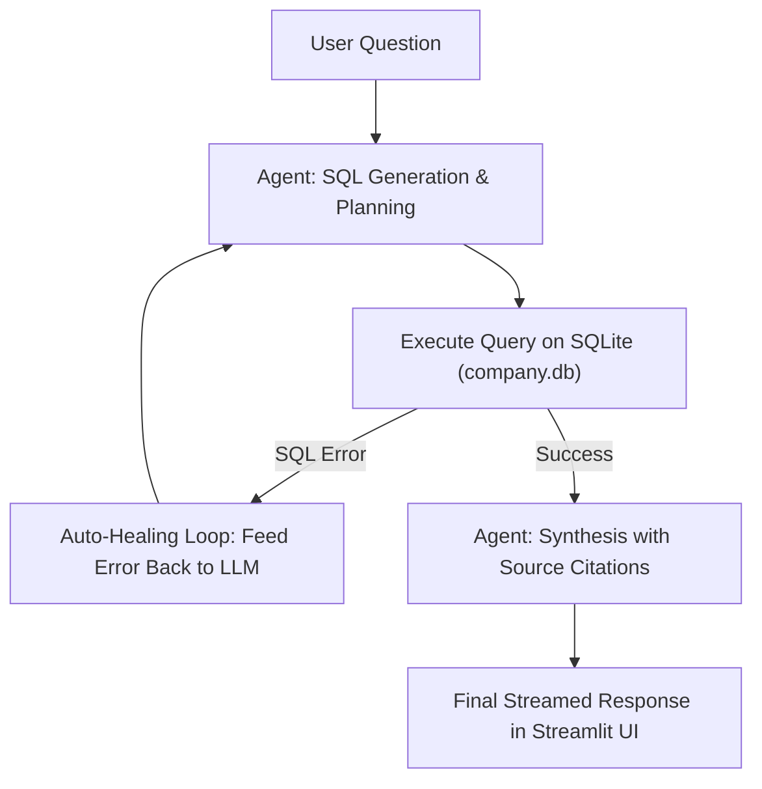

# Live Database Information Assistant 🤖

An agentic AI assistant built with **Streamlit**, **Ollama**, and **SQLite** for the Turku AMK AI Showcase Challenge.

The assistant converts natural language questions into executable SQLite queries, executes them in real time against a live database, autonomously corrects any SQL errors via a self-healing feedback loop, and synthesizes answers with explicit citations.

---

## 🌟 Key Features

- **Text-to-SQL Conversion**: Translates user questions into schema-aware SQLite queries with fuzzy matching (`LIKE '%...%'`).
- **Autonomous Agentic Behavior (Self-Healing Loop)**: If a generated SQL query fails, the agent inspects the database error, re-evaluates the schema, and automatically generates a corrected query (up to 3 retries).
- **Real-Time Thought Streaming (Debug Mode)**:
  - Streams the model's internal reasoning monologue (`qwen3.5:9b` thinking tokens) live to the frontend.
  - Visualizes generated SQL queries, execution results, and tabular database records in real time.
- **Source Citations**: Every response includes precise citations referencing tables, row IDs, or column names where the data was retrieved.
- **Interactive UI**: Includes a live database inspector to preview tables (`products`, `quotations`, `orders`) and quick-start example questions.

---

## 🏗️ Architecture & Agent Flow



---

## 📋 Prerequisites

1. **Python 3.9+**
2. **[Ollama](https://ollama.com/)** installed and running
3. Model downloaded via Ollama:
   ```bash
   ollama pull qwen3.5:9b
   ```

---

## 🚀 Quickstart Guide

### 1. Clone the Repository
```bash
git clone https://github.com/<your-username>/<your-repo-name>.git
cd <your-repo-name>
```

### 2. Set Up a Virtual Environment
```bash
python3 -m venv venv
source venv/bin/activate
```

### 3. Install Dependencies
```bash
pip install -r requirements.txt
```

### 4. Initialize the Mock Database
```bash
python seed_db.py
```

### 5. Run the Application
```bash
streamlit run app.py
```

Open your browser at `http://localhost:8501`.

---

## 📂 Project Structure

```text
├── app.py          # Main Streamlit application with agentic loop & thought streaming
├── seed_db.py      # Database initialization script for mock company data
├── company.db      # SQLite database (generated by seed_db.py)
├── requirements.txt# Project Python dependencies
├── .gitignore      # Git exclusion rules (venv, caches, etc.)
└── README.md       # Project documentation
```
